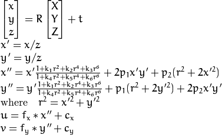

This package generate proposals from ROS topics(Lidar, Radar, RGB Camera), which is needed in didi_classify package.

# Simple Algorithm 1:

Use radar point(p) to project into image plane(p'), and draw square that centers at p' with width that equals C/l. C is a handcraft constant, l is the distance from p to capture car.

## Radar point to image point (Codes done, but wait for calibration files to check)

[Here](http://docs.opencv.org/2.4/modules/calib3d/doc/camera_calibration_and_3d_reconstruction.html) you can find full details about camera 3D point projection.

  
We need camera-radar calibration matrix (3 * 4), which specifies rotation and relative position of camera to radar, and transforms radar XYZ to camera XYZ.

We need camera intrinsic matrix (3 * 3, 1 * 5), which transforms camera XYZ to plane XY. 

Calibration parameters is hard-coded in scripts/radar2image.py and lidar2image.py. Modify them before run:

`$ rosrun didi_proposal lidar2image.py`

to see lidar points painted on image plane, or

`$ rosrun didi_proposal radar2image.py`

to see radar points painted on image plane

## Image point to Image box

Assume image point (X,Y), Image box is (X-C/2l, Y-C/2l, X+C/2l, Y+C/2l), and crop RGB Images as region proposals.

# Simple Algorithm 2:

There is also another way to avoid waiting calibration file.

Feed bird-view of lidar, radar image and camera image into CNN, and classy if there exists cars in camera, and regress to relative position with capture car at center. This method can only apply in one moving car situation.

